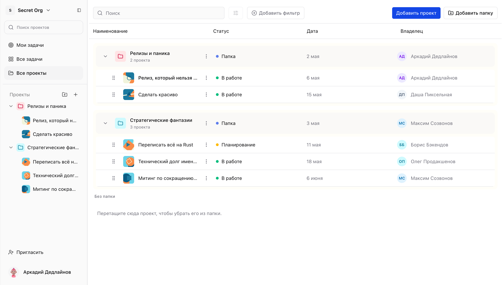
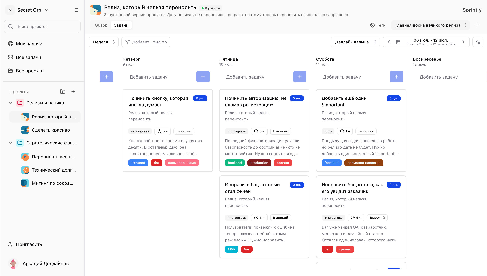
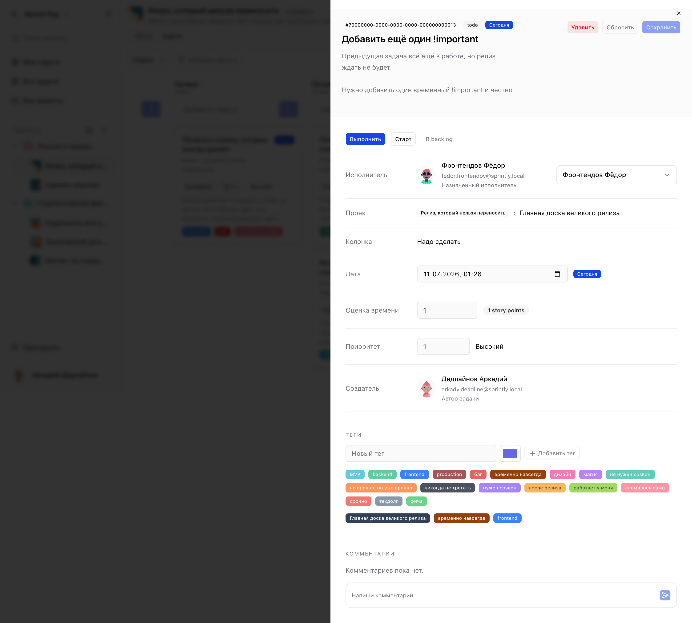
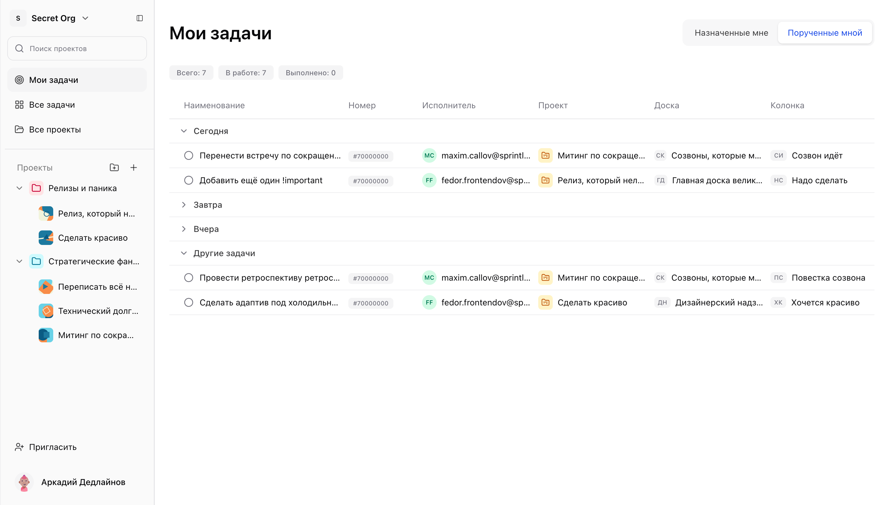

# Sprintly

Sprintly помогает команде вести проекты, задачи и обсуждения в одном месте. В приложении есть организации, Kanban-доски, календарь, роли и доступы.



## Какую проблему решает Sprintly

Команды часто ведут задачи, сроки и обсуждения в разных инструментах. Контекст теряется, а состояние проекта становится трудно оценить.

Sprintly собирает работу в одном пространстве. Руководитель видит проекты и загрузку команды. Участники понимают свои задачи, сроки и обсуждения.

## Основные возможности

### Команды и организации

Пользователь может работать в нескольких организациях. Данные разделены, а роли помогают управлять доступом.

### Проекты и участники

Проекты можно группировать по папкам и наполнять участниками. Так разные направления работы не смешиваются.

### Задачи и планирование

В задачах есть исполнители, сроки, приоритеты и теги. Для планирования доступны недельный и месячный режимы.



### Kanban-доски

Kanban-доска показывает этапы работы по задачам. Карточки можно распределять по колонкам и быстро видеть очереди.

### Совместная работа

Комментарии хранят обсуждение рядом с задачей. Поиск, фильтры и сортировка помогают быстро находить нужную работу.



### Доступ и безопасность

Авторизация построена на JWT. Пользователь видит только активную организацию и доступные ему проекты.

## Основной сценарий использования

1. Пользователь регистрируется или входит в систему.
2. Создаёт организацию или принимает приглашение в существующую.
3. Создаёт проект и добавляет участников команды.
4. Заводит задачи, назначает исполнителей, сроки, приоритеты и теги.
5. Управляет работой через Kanban-доску, недельное или месячное представление.
6. Обсуждает детали в комментариях и отслеживает свои задачи в личном разделе.



## Технологии

### Frontend

- `Next.js`: маршруты и страницы.
- `React`: интерфейс приложения.
- `TypeScript`: типизация кода.
- `TanStack Query`: работа с серверными данными.
- `dnd-kit`: перетаскивание карточек.
- `Tailwind CSS`: стили интерфейса.
- `shadcn/ui`: UI-компоненты.

### Backend

- `Java`: backend-платформа.
- `Spring Boot`: REST API и серверная логика.
- `Spring Security`: авторизация и проверка доступа.
- `Spring Data JPA`: работа с PostgreSQL.
- `PostgreSQL`: база данных.
- `Redis`: кэширование.
- `Liquibase`: миграции базы.

### Инфраструктура

- `Docker Compose`: локальный запуск сервисов.
- `OpenAPI / Swagger`: документация API.
- `S3-совместимое хранилище`: файлы и изображения.

## Архитектура

Sprintly разделён на frontend и backend. Frontend отвечает за интерфейс, формы и доски. Backend хранит данные, проверяет доступ и отдаёт REST API.

Данные с сервера загружаются через `TanStack Query`. Локальное состояние остаётся внутри экранов и компонентов.

Backend построен слоями: контроллеры, сервисы и репозитории. Доступ зависит от организации и участия в проекте.

## Запуск проекта

Нужно установить:

- Docker и Docker Compose;
- Java 21;
- Maven;
- Node.js 20 или новее;
- npm.

### 1. Запустить backend, PostgreSQL и Redis

```bash
cd java-backend
cp .env.example .env
docker compose up --build -d
```

Backend будет доступен на `http://localhost:8080`.

Swagger UI:

```text
http://localhost:8080/swagger-ui
```

### 2. Запустить frontend

```bash
cd frontend
npm ci
```

Создайте `frontend/.env.local`:

```bash
cat > .env.local <<'EOF'
API_PROXY_TARGET=http://127.0.0.1:8080
NEXT_PUBLIC_RECAPTCHA_SITE_KEY=replace-with-recaptcha-site-key
EOF
```

Запуск frontend:

```bash
npm run dev
```

Приложение откроется на `http://localhost:3000`.

## Структура репозитория

```text
sprintly-app/
├── frontend/
│   ├── app/        # маршруты Next.js, layout и провайдеры
│   ├── views/      # экраны приложения
│   ├── widgets/    # крупные блоки интерфейса
│   └── shared/     # API-клиент, UI, хуки и утилиты
└── java-backend/
    ├── src/main/java/com/sprintly/backend/
    │   ├── controller/   # REST-контроллеры
    │   ├── service/      # бизнес-логика
    │   ├── repository/   # работа с данными
    │   ├── entity/       # сущности базы данных
    │   └── security/     # авторизация и доступ
    ├── src/main/resources/db/changelog/ # миграции Liquibase
    ├── docker-compose.yml
    ├── Dockerfile
    └── pom.xml
```
